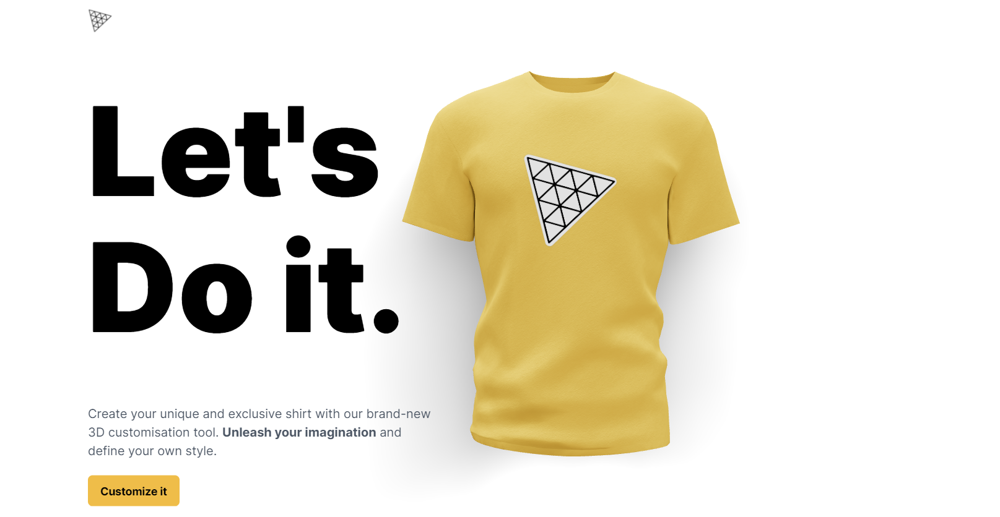

# 3D T-Shirt Design Website



Welcome to the 3D T-Shirt Design Website! This web application allows users to design custom T-shirts by changing colors and uploading logos. Additionally, it leverages the OpenAI API to generate customized logos.

## Features

- **Customize T-Shirt Design:**
  - Change the color of the T-shirt to your liking.
  - Upload your own logos and graphics to be displayed on the T-shirt.

- **OpenAI Logo Generator:**
  - Generate custom logos and graphics using the OpenAI API.
  - Provide unique, AI-generated designs for your T-shirt.

## Getting Started

To get started with the project, follow these steps:

1. **Clone the Repository:**

```
git clone https://github.com/Pankajjsuthar/threejs_tshirt.git
```
2. **Install Dependencies:**
```
cd threejs_tshirt
npm install
```
**Run the Application:**
```
npm run dev
```

4. **Access the Website:**
Open your web browser and go to `http://localhost:5173` to access the T-shirt design website.

## Usage

1. **Customize T-Shirt:**
- Click on Customise it.
- Use the color picker to change the T-shirt color.
- Click "Upload Logo" to upload your own logo or use the OpenAI Logo Generator to create one.

2. **OpenAI Logo Generator:**
- To use the OpenAI Logo Generator, you need to prompt the AI for logo.
- Once you have the API key, configure it in the settings.
- Click "Generate Logo" to create a customized logo.

## Configuration

Before using the OpenAI Logo Generator, you need to configure your API key. Create a `.env` file in the project root and add the following:
```OPENAI_API_KEY=your-api-key```

## Contributing

We welcome contributions to improve the project! If you'd like to contribute, please follow these steps:

1. Fork the repository.
2. Create a new branch for your feature or bug fix: `git checkout -b feature-name`
3. Make your changes and commit them: `git commit -m 'Add new feature'`
4. Push your changes to your fork: `git push origin feature-name`
5. Create a pull request to the main repository.
